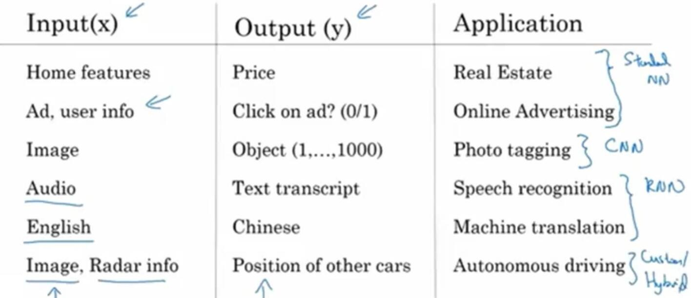
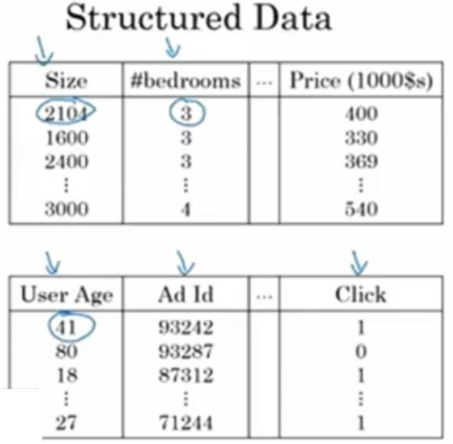
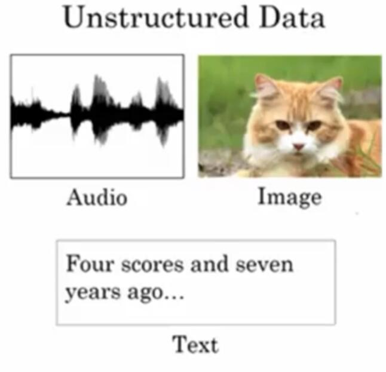

# 1.3 用神经网络进行监督学习

> 视频：<https://mooc.study.163.com/learn/deeplearning_ai-2001281002?tid=2001392029#/learn/content?type=detail&id=2001701006>

神经网络有时被媒体炒作得很厉害，考虑到它们的使用效果，有些说法还是靠谱的。事实上到目前为止，几乎所有由神经网络创造的经济价值，都基于其中一种机器学习，我们称之“监督学习”。那是什么意思呢？我们来看一些例子。

在监督学习中，输入`x`会习得一个函数，它映射到输出`y`。比如我们之前看到的，应用于房价预测的例子。输入房屋的一些特征，就能输出或者预测价格`y`。下面是一些其它例子，这些例子中神经网络效果拔群。

很可能，今天通过深度学习获利最大的，就是在线广告。这也许不是最鼓舞人心的，但真的很赚钱。给网站输入广告信息，网站会考虑是否给你看这个广告，有时还需要输入一些用户信息。神经网络在预测，你是否会点击这个广告，这方面已经表现得很好了。通过向你展示，以及向用户展示最有可能点开的广告，这就是神经网络在很多家公司，赚取无法想象的高额利润的应用方式。因为有了这种能力，向你展示最有可能点击开的广告，直接影响到了不少大型线上广告公司的收入。

过去的几年里，计算机视觉也有很大进展，这要感谢深度学习。你输入一个图像，然后打算输出一个下标，可以是从 1 到 1000，来表明这张照片，是 1000 个不同的图像中的某一个。它可以用来给照片打标签。

深度学习最近在语音识别方面的进展也是非常令人兴奋的。你可以将音频片段输入神经网络，它可以输出文本。机器翻译也进步很大，这得感谢深度学习，让你有一个神经网络，能实现输入英语句子，它直接输出一个中文句子。

在无人驾驶技术中，你输入一幅图像，比如汽车前方的一个快照，还有一些雷达信息。基于这个，训练过的神经网络，能告诉你路上其他汽车的位置。这是无人驾驶系统的关键组件。

神经网络创造这么多价值的案例中，你要机智地选择`x`和`y`，才能解决特定问题。然后把这个监督学习过的组件，嵌入到更大型的系统中，比如无人驾驶。可以看出，稍微不同的神经网络，也可应用到不同的地方。比如说，应用到房地产上。我们上节课看到，我们用了通用标准的神经网络架构，是吧？对于房地产和在线广告，用的都是相对标准的神经网络，正如我们之前见到的。

图像领域里，我们经常应用的是卷积神经网络，通常缩写为 CNN。对于序列数据，例如音频中含有时间成分，对吧？音频是随着时间播放的，所以音频很自然地被表示为一维时间序列。对于序列数据，你经常使用 RNN，循环神经网络。

对于语言，英语和汉语，字母或单词，都是逐个出现的。所以，语言最自然的表示方式也是序列数据。更复杂的 RNN 经常会用于这些应用。对于更复杂的应用，比如无人驾驶，你有一张图片，可能需要 CNN “卷积神经网络结构” 架构去处理。雷达信息会更不一样，你需要一些更复杂的，混合的神经网络结构。

所以，为了更具体地说明，标准的 CNN 和 RNN 结构是什么。在文献中，你可能见过这样的图片，这是一个标准的神经网络。你可能见过这样的图片，这是一个卷积神经网络。在后续的课程，我们会去了解这幅图的含义和如何实现它。卷积网络通常用于图像数据。你可能也会看到这样的图片，后续的课程也会去实现它。循环神经网络非常适合处理一维序列数据，其中包含时间成分。

你可能也听说过，机器学习被应用于结构化数据和非结构化数据，下面是这些术语的含义。结构化数据，是数据的数据库，例如在房价预测中，你可能有一个数据库或者数据列，告诉你房间的大小和卧室数量，这就是结构化数据。在预测用户是否会点击广告的例子中，你可能会有用户信息比如年龄，还有广告信息，还有你要预测的标签`y`，这就是结构化数据，意味着每个特征，比如说房屋大小、卧房数量、用户的年龄，都有着清晰的定义。

相反，非结构化数据指的是，比如音频、原始音频、图像，你想要识别图像或文本中的内容。这里的特征可能是图像中的像素值，或者是文本中的单个单词。从历史角度看，与结构化数据比较，非结构化数据让计算机理解起来更难。但人类进化到现在，很擅长理解音频信号和图像。文本是一个更近代的发明，但人们真的很擅长解读非结构化数据。

神经网络的兴起过程中，最令人兴奋的事情之一就是，多亏了深度学习，多亏了神经网络，计算机现在能更好地解释非结构化数据。和几年前对比的话，这给我们创造了很多令人兴奋的应用机会。语音识别、图像识别、自然语言文字处理。现在能做的事情，比两三年前要丰富多了，我认为，因为人们生来就有能力，来理解非结构化数据。

你可能知道，神经网络在非结构化数据上的成功，尤其是媒体。当神经网络识别了一只猫时，那真的很酷。我们都知道，那意味着什么。神经网络在很多短期经济价值的创造，是基于结构化数据的，比如更好的广告系统，更好的获利建议，有更好的能力去处理很多公司拥有的海量数据库，并用这些数据准确预测未来趋势。

在这门课中，我们会学到很多技巧，可以应用到结构化数据，也可以应用到非结构化数据。为了更清楚地解释算法原理，我们会多用非结构化数据的例子。但当你自己的团队评估了各种神经网络的应用之后，希望你的算法能够同时学习结构化和非结构化数据。神经网络彻底改变了监督学习，正创造着巨大的经济价值。

其实呢，基本的神经网络背后的技术理念，大部分都不是新概念，有些甚至有几十年历史了。那么，为什么它们现在才流行，才行之有效呢？下一集视频中我们将讨论，为什么是最近神经网络才成为你可以使用的强大工具。
