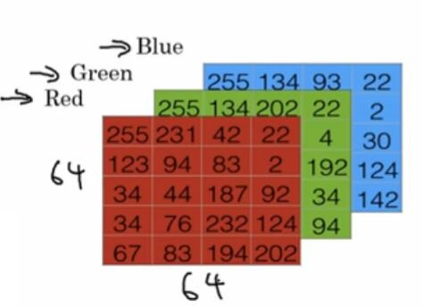
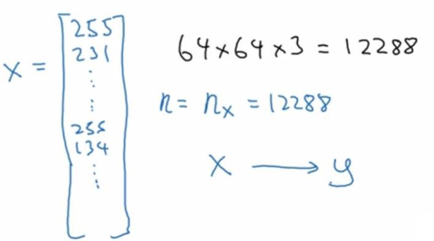
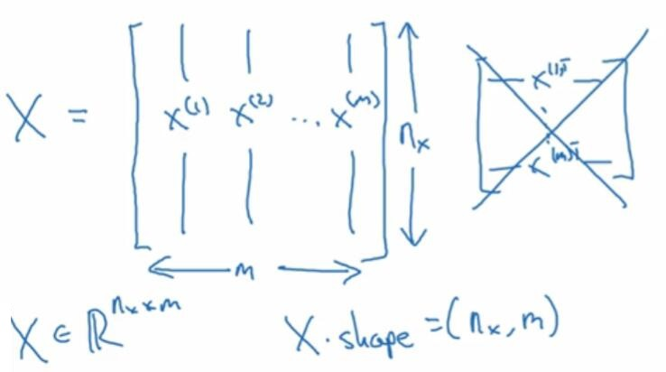
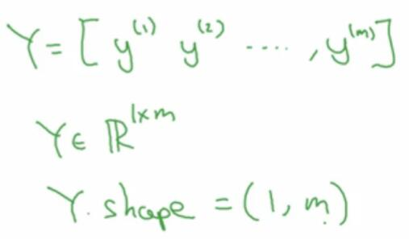

# 2.1 二分分类

> 视频：<https://mooc.study.163.com/learn/deeplearning_ai-2001281002?tid=2001392029#/learn/content?type=detail&id=2001702006>

本周我们会学习神经网络编程的基础知识。当你要构建一个神经网络，有些技巧是相当重要的。例如。对于`m`个样本的训练集，你可能会习惯性地去用一个`for`循环，来遍历这`m`个样本。但事实上，实现一个神经网络，如果你要遍历整个训练集，并不需要直接使用`for`循环。本周的课程中，你会学习如何做到它。

还有就是，神经网络的计算过程中，通常有一个正向过程，或者叫正向传播步骤。接着会有一个反向步骤，也叫做反向传播步骤。这周的学习材料中，我也会给你介绍，为什么神经网络的计算过程可以，分为前向传播和反向传播，两个分开的过程。

本周课程中，我会用logistic回归来阐述，以便于你能更好地理解。如果你之前学过logistic回归，我也认为这周的学习材料，也会带给你一些新的、有意思的想法。下面开始吧。

logistic回归是一个用于二分分类的算法，我们从一个问题开始。这有一个二分分类问题的例子，假如你有一张图片作为输入，是这样子的。你想输出识别此图的标签，如果是猫输出1，如果不是则输出0。我们用`y`来表示输出的结果标签。来看看一张图片，在计算机中是如何表示的

来看看一张图片，在计算机中是如何表示的。计算机保存一张图片，要保存三个独立矩阵，分别对应图片中的红、绿、蓝三个颜色通道。如果输入图片是`64×64`像素的，就有三个64×64的矩阵，分别对应图片中的红、绿、蓝三种像素的亮度。为了方便表示，这里我用三个小矩阵，它们是`5×4`的，并不是`64×64`的。

要把这些像素亮度值放进一个特征向量中，就要把这些像素值都提出来，放入一个特征向量`x`。为了把这些像素值取出放入特征向量，就要像下面这样定义一个特征向量`x`，以表示这张图片。我们把所有的像素值都取出来，例如`255`、`231`这些，直到列完所有的红色像素，接着是`255`、`134`、`255`、`134`等等。最后得到一个很长的特征向量，把图片中所有的红、绿、蓝像素亮度值都列出来。如果图片是`64×64`的那么向量`x`的总维度，就是`64×64×3`，因为这是三个矩阵的元素数量。对于这个例子，数字是`12288`。把它们乘起来这就是结果。我们用`nx=12288`，来表示输入的特征向量`x`的维度。有时候为了简洁，我会直接用小写的`n`，来表示输入的特征向量的维度。

在二分分类问题中，目标是训练出一个分类器，它以图片的特征向量`x`作为输入，预测输出的结果标签`y`是`1`还是`0`。也就是，预测图片中是否有猫。现在我们看看在后面课程中，需要用到的一些符号。用一对`(x,y)`来表示一个单独的样本，`x`是`nx`维的特征向量，标签`y`值为`0`或`1`。训练集由`m`个训练样本构成。`(x^(1),y^(1))`表示样本一的输入和输出。`(x^(2),y^(2))`表示样本二，`(x^(m),y^(m))`表示最后一个样本`m`。这些一起就表示整个训练集。用小写的字母`m`，来表示训练样本的个数。有时候为了强调，这是训练样本的个数，可以写作`m=m_train`。

当说到测试集时，我们会用`m_test`，来表示测试集的样本数。所以，这是测试集的样本数。最后，用更紧凑的符号表示训练集。我们定义一个矩阵，用大写的`X`表示，它由训练集中的`x1`、`x2`这些组成，像这样写成矩阵的列。现在我们把`x^(1)`放进矩阵的第一列，`x^(2)`是第二列 …… `xm`是第`m`列。最后得到矩阵`X`，这个矩阵有`m`列，`m`是训练集的样本数，这个矩阵的高度记为`nx`。

要注意的是，有时候矩阵`X`的定义，训练样本作为行向量堆叠，而不是这样列向量堆叠（比如 Sklearn 中的数据集），`x^(1)T` …… `x^(m)T`。构建神经网络时，用左边这个约定形式。会让构建过程简单得多。

现在回顾一下，`X`是一个`nx×m`矩阵，当你用 Python 实现的时候，你会看到`X.shape`这是一条 Python（NumPy）命令，用来输出矩阵的维度即`(nx,m)`。表示`X`是一个`nx×m`矩阵。这就是如何将训练样本，即输入`x`用矩阵表示。

那输出标签`y`呢？同样为了方便，构建一个神经网络，将`y`标签也放到列中。我们定义`Y`是`y^(1)`、`y^(2)`，一直到`y^(m)`。这里的`Y`是一个`1×m`矩阵。同样地，在 Python 里`Y.shape`等于`(1,m)`，表示这是一个`1×m`矩阵。

在后面的课程中，要实现神经网络时，你会发现，好的惯例符号，能够将不同训练样本的数据联系起来。这里说的数据不仅有`x`和`y`，还会有之后其他的量。将不同的训练样本数据取出来，放到不同的列上，就像刚刚我们处理`x`和`y`那样。

这门课中，logistic回归和神经网络要用到的符号就是这些了。如果你忘了这些符号的意义，比如什么是`m`什么是`n`，或者其他，我们也会在课程网站上，放上符号说明，这样你就可以快速地查阅每个符号的意义。

就这样吧，下个课程视频中，我们以logistic回归作为开始。

